# aws-secure-3tier-apps
AWS 3-Tier Web App Architecture with Security Controls and ISO 27001 Mapping 

# AWS Secure 3-Tier Application (Manual Console Project)
This hands-on project builds and secures a 3-tier web application architecture using the AWS Console.

It includes:
- Secure VPC network setup
- IAM least privilege roles
- Encrypted RDS database
- CloudTrail and Config logging
- Threat detection with GuardDuty
- WAF and S3 security
- ISO/IEC 27001:2022 control mapping

## Project Progress (Live Tracking)
- [x] VPC created
- [x] Subnets configured
- [x] Internet + NAT Gateway set up
- [x] EC2 launched with IAM role
- [x] RDS encrypted with KMS
- [ ] CloudTrail and Config enabled
- [ ] WAF + Security Hub configured
- [ ] ISO 27001 mapping drafted

##  Step 1: VPC + Subnet Setup

- Created custom VPC named `Secure3TierVPC`
- CIDR Block: `10.0.0.0/16`
- Created 3 subnets:
  - Public Subnet (for ALB): `10.0.1.0/24`
  - Private Subnet A (Web/App EC2): `10.0.2.0/24`
  - Private Subnet B (RDS): `10.0.3.0/24`
- Created Internet Gateway and attached it to the VPC
- Created NAT Gateway for private subnet internet access
- Updated Route Tables:
  - Public → IGW
  - Private → NAT GW

 ### Screenshots(step by step)
 
| Step | Screenshot |
|------|------------|
| ✅ 1. VPC Created | 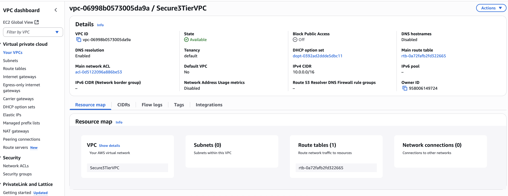 |
| ✅ 2. Subnets Configured | 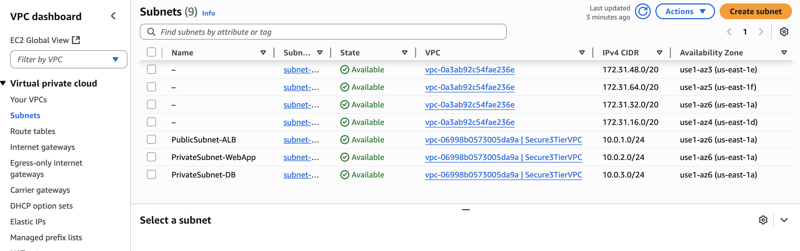 |
| ✅ 3. Internet Gateway Attached | 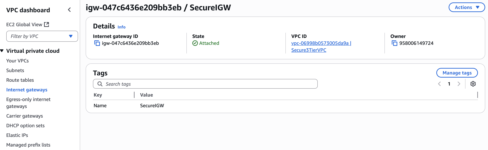 |
| ✅ 4. NAT Gateway Created | 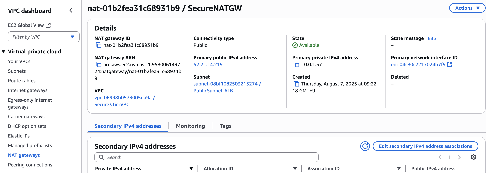 |
| ✅ 5. Public Route Table | 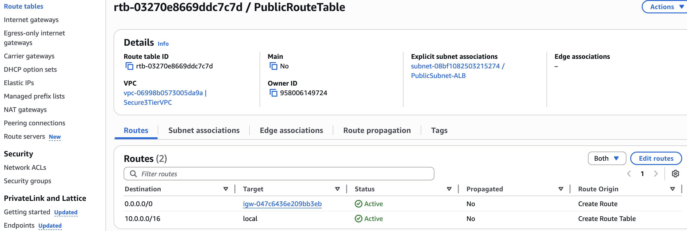 |
| ✅ 6. Private Route Table | 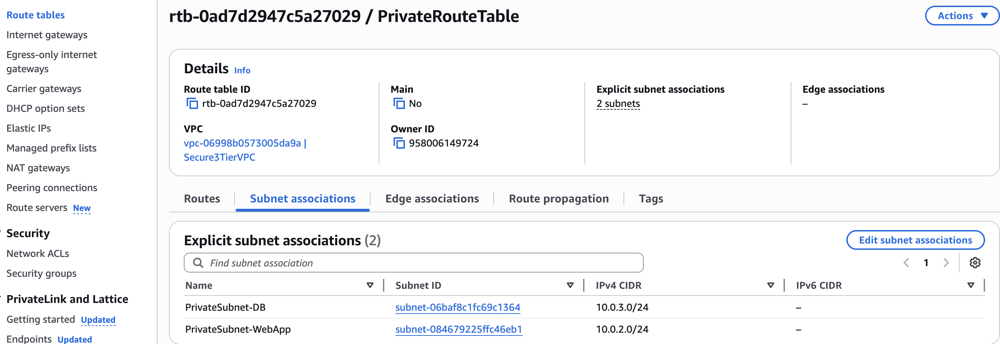 |

---

## Step 2 – EC2 in Private Subnet with IAM Role Setup

In this step, I launched an Amazon EC2 instance into a **private subnet** to simulate an internal application server that is **not directly accessible from the internet**. The instance is designed to retrieve data securely from AWS services like S3 without exposing sensitive workloads.

To follow the principle of **least privilege**, I created a custom **IAM role** with **AmazonS3ReadOnlyAccess** and attached it to the EC2 instance. This allows the instance to access S3 buckets without needing access keys or internet access.

### Key Security Features:
- No public IP assigned (private by design)
- Access to the internet is routed through a **NAT Gateway**
- IAM role enforces **secure access to AWS services** (e.g., S3) without hardcoding credentials

### Screenshots:

| Step | Screenshot |
|------|------------|
| ✅ IAM Role Created | 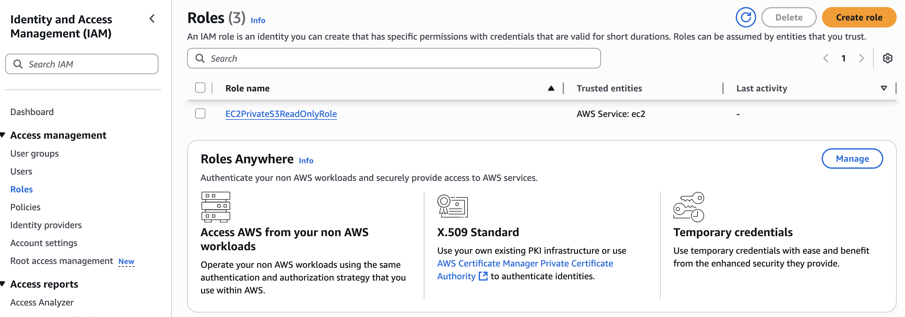 |
| ✅ EC2 in Private Subnet (Launch Config) | 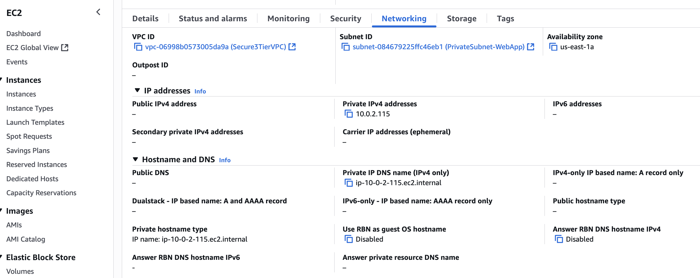 |
| ✅ EC2 Instance Details (Private) | 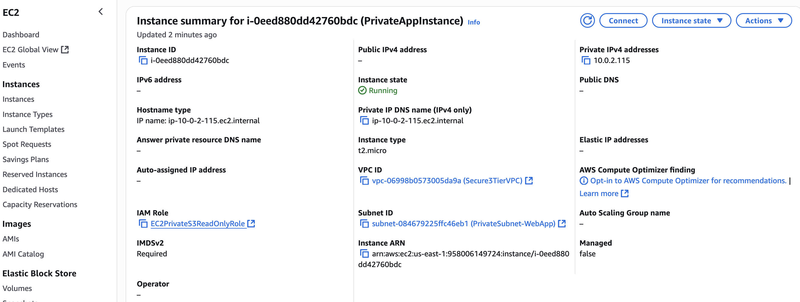 |

**This step aligns with ISO/IEC 27001 control objectives such as:**
- **A.9.1.2:** Access to networks and network services
- **A.9.2.1:** User access provisioning
- **A.9.4.1:** Information access restriction

---

## Step 3 – RDS Encrypted with AWS KMS

In this step, I deployed an Amazon RDS MySQL database in a **private subnet** with **encryption at rest** enabled via AWS Key Management Service (KMS) to protect sensitive data and meet compliance standards. Encryption was enabled in the **Backup** section using the default AWS-managed KMS key (`aws/rds`), ensuring that storage, automated backups, snapshots, and read replicas are all encrypted automatically.

### Key Security Features:
- Deployed in **private subnets** (no public access) within the custom VPC  
- **Encryption at rest** enabled via AWS KMS (`aws/rds`)  
- Automated backups encrypted with the same KMS key  
- Access restricted via VPC security groups to authorized application servers only  

### Screenshots:

| Step | Screenshot |
|------|------------|
| ✅ Encryption Enabled in Backup Section | 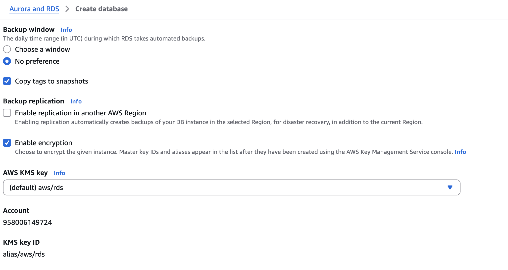 |
| ✅ Final DB Configuration Showing Encryption Active | 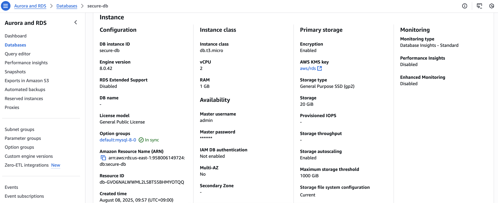 |

**This step aligns with ISO/IEC 27001 control objectives such as:**
- **A.10.1:** Cryptographic controls — encryption applied to protect information at rest  
- **A.12.3.1:** Information backup — ensuring backups are protected from unauthorized access  
- **A.13.1.1:** Network controls — restricting database access to authorized internal resources only  
