# aws-secure-3tier-apps
AWS 3-Tier Web App Architecture with Security Controls and ISO 27001 Mapping 

# AWS Secure 3-Tier Application (Manual Console Project)
This hands-on project builds and secures a 3-tier web application architecture using the AWS Console.

It includes:
- Secure VPC network setup
- IAM least privilege roles
- Encrypted RDS database
- CloudTrail and Config logging
- Threat detection with GuardDuty
- WAF and S3 security
- ISO/IEC 27001:2022 control mapping

## Project Progress (Live Tracking)
- [x] VPC created
- [x] Subnets configured
- [x] Internet + NAT Gateway set up
- [x] EC2 launched with IAM role
- [x] RDS encrypted with KMS
- [x] CloudTrail and Config enabled
- [x] WAF + Security Hub configured
- [x] ISO 27001 mapping drafted

##  Step 1: VPC + Subnet Setup

- Created custom VPC named `Secure3TierVPC`
- CIDR Block: `10.0.0.0/16`
- Created 3 subnets:
  - Public Subnet (for ALB): `10.0.1.0/24`
  - Private Subnet A (Web/App EC2): `10.0.2.0/24`
  - Private Subnet B (RDS): `10.0.3.0/24`
- Created Internet Gateway and attached it to the VPC
- Created NAT Gateway for private subnet internet access
- Updated Route Tables:
  - Public → IGW
  - Private → NAT GW

 ### Screenshots(step by step)
 
| Step | Screenshot |
|------|------------|
| ✅ 1. VPC Created |  |
| ✅ 2. Subnets Configured |  |
| ✅ 3. Internet Gateway Attached |  |
| ✅ 4. NAT Gateway Created |  |
| ✅ 5. Public Route Table |  |
| ✅ 6. Private Route Table |  |

---

## Step 2 – EC2 in Private Subnet with IAM Role Setup

In this step, I launched an Amazon EC2 instance into a **private subnet** to simulate an internal application server that is **not directly accessible from the internet**. The instance is designed to retrieve data securely from AWS services like S3 without exposing sensitive workloads.

To follow the principle of **least privilege**, I created a custom **IAM role** with **AmazonS3ReadOnlyAccess** and attached it to the EC2 instance. This allows the instance to access S3 buckets without needing access keys or internet access.

### Key Security Features:
- No public IP assigned (private by design)
- Access to the internet is routed through a **NAT Gateway**
- IAM role enforces **secure access to AWS services** (e.g., S3) without hardcoding credentials

### Screenshots:

| Step | Screenshot |
|------|------------|
| ✅ IAM Role Created |  |
| ✅ EC2 in Private Subnet (Launch Config) |  |
| ✅ EC2 Instance Details (Private) |  |

**This step aligns with ISO/IEC 27001 control objectives such as:**
- **A.9.1.2:** Access to networks and network services
- **A.9.2.1:** User access provisioning
- **A.9.4.1:** Information access restriction

---

## Step 3 – RDS Encrypted with AWS KMS

In this step, I deployed an Amazon RDS MySQL database in a **private subnet** with **encryption at rest** enabled via AWS Key Management Service (KMS) to protect sensitive data and meet compliance standards. Encryption was enabled in the **Backup** section using the default AWS-managed KMS key (`aws/rds`), ensuring that storage, automated backups, snapshots, and read replicas are all encrypted automatically.

### Key Security Features:
- Deployed in **private subnets** (no public access) within the custom VPC  
- **Encryption at rest** enabled via AWS KMS (`aws/rds`)  
- Automated backups encrypted with the same KMS key  
- Access restricted via VPC security groups to authorized application servers only  

### Screenshots:

| Step | Screenshot |
|------|------------|
| ✅ Encryption Enabled in Backup Section |  |
| ✅ Final DB Configuration Showing Encryption Active |  |

**This step aligns with ISO/IEC 27001 control objectives such as:**
- **A.10.1:** Cryptographic controls — encryption applied to protect information at rest  
- **A.12.3.1:** Information backup — ensuring backups are protected from unauthorized access  
- **A.13.1.1:** Network controls — restricting database access to authorized internal resources only

---

## Step 4A – CloudTrail (Multi-Region, SSE-KMS, Integrity Validation, CW Logs)

In this step, I enabled **AWS CloudTrail** to capture and store all management events across all regions, with log files encrypted using a **customer-managed KMS key** and **Log File Validation** enabled for tamper detection.  
Logs are delivered to an **S3 bucket** with secure bucket policies, and also streamed in near-real time to **CloudWatch Logs** for monitoring and analysis.

### Key Security Features:
- **Multi-Region trail** *(default in 2025 console)* – captures events from all AWS regions
- **SSE-KMS encryption** with a project-specific CMK alias (`alias/ct-logs`)
- **Log File Validation** to detect any modification of log files
- **Secure bucket policy** allowing only CloudTrail to write logs
- **CloudWatch Logs integration** with a dedicated log group and IAM role for delivery

### Screenshots:

| Step | Screenshot |
|------|------------|
| ✅ Create Trail – General | 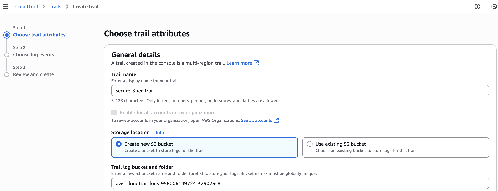 |
| ✅ S3 + KMS Settings | 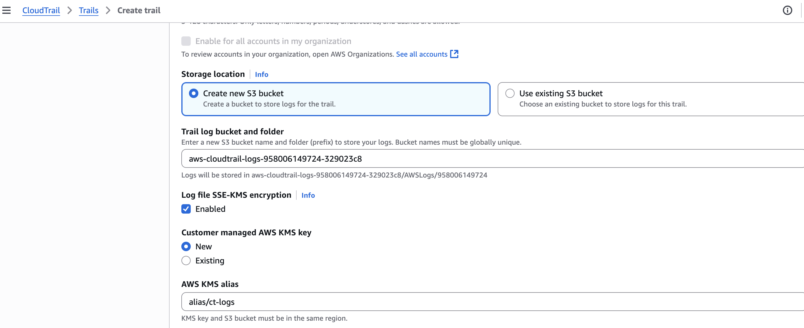 |
| ✅ Log File Validation Enabled | 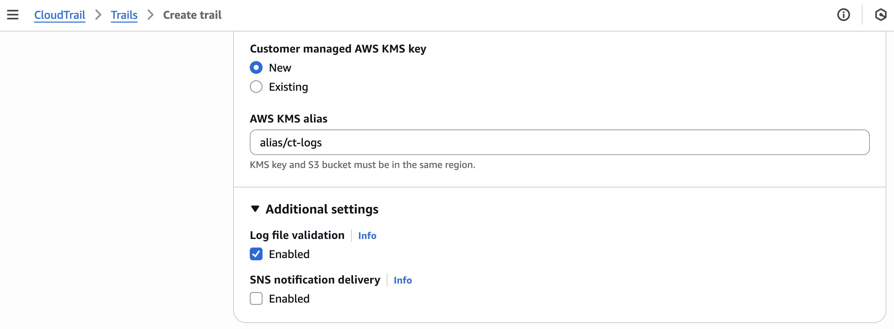 |
| ✅ CloudWatch Logs Integration | 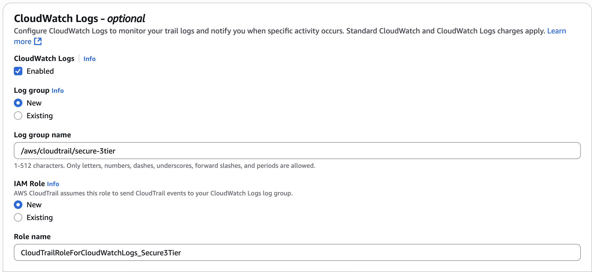 |
| ✅ Event History Showing CreateTrail Event | 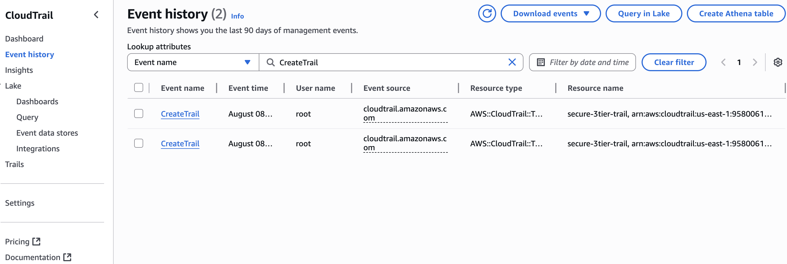 |

---

## Appendix – Additional Compliance Proofs

These additional screenshots verify that the CloudTrail logging configuration meets **ISO/IEC 27001:2022** and other compliance standards for secure log storage and access control.

| Proof | Screenshot |
|-------|------------|
| Bucket Policy allowing CloudTrail to write logs securely | 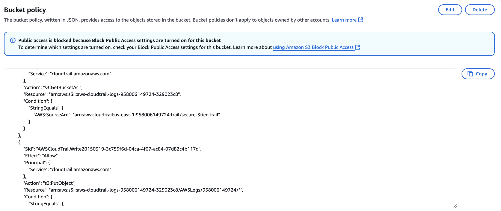 |
| Event Detail showing request metadata and resources affected | 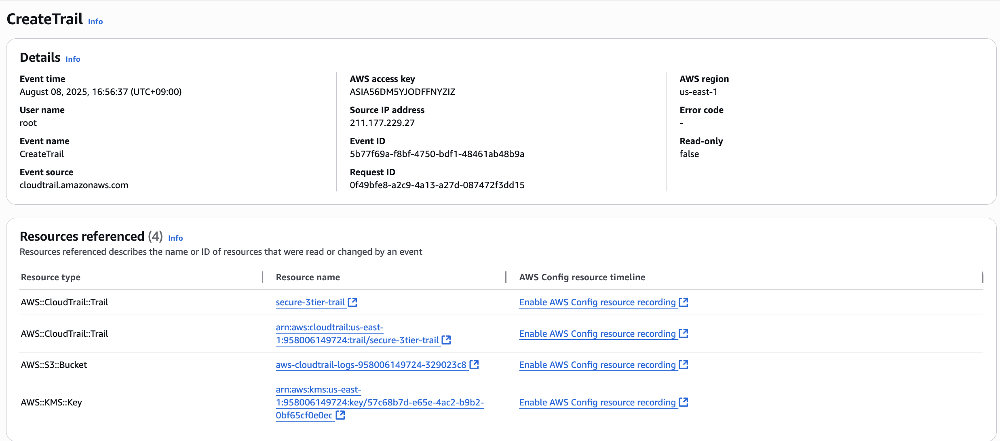 |
| Bucket Permissions Summary confirming Block Public Access is ON | 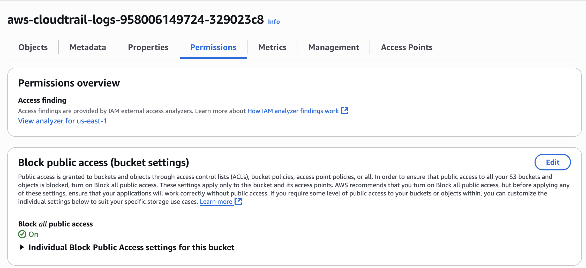 |

---

## Step 4B – AWS Config (Continuous Recording & Compliance Rules)

Enabled **AWS Config** to record all resource changes continuously, storing history in an **S3 bucket with SSE-KMS encryption**.  
Deployed AWS Managed Config Rules to enforce encryption and logging best practices.

### Key Features:
- Continuous recording of all resources
- SSE-KMS encryption (inherited from bucket default)
- Automated compliance checks:
  - CLOUD_TRAIL_ENABLED
  - S3_BUCKET_PUBLIC_READ_PROHIBITED
  - EBS_ENCRYPTION_BY_DEFAULT
  - S3_BUCKET_SERVER_SIDE_ENCRYPTION_ENABLED

### Screenshots:**

| Step | Screenshot |
|------|------------|
| ✅ S3 Bucket Encryption for Config Logs | 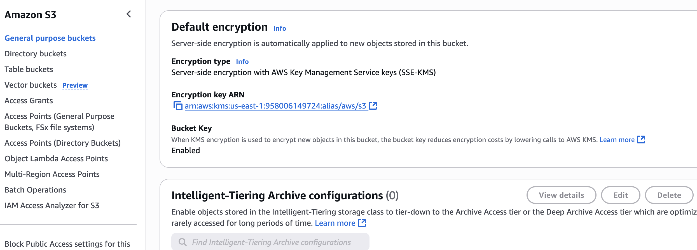 |
| ✅ Config Delivery Channel | 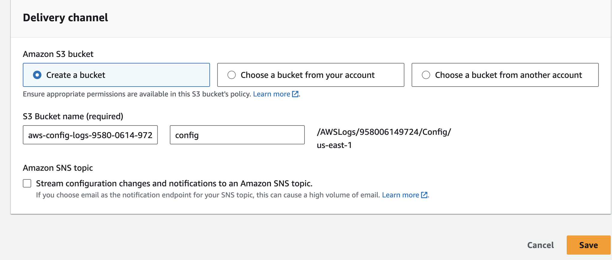 |
| ✅ Config Rules Added | 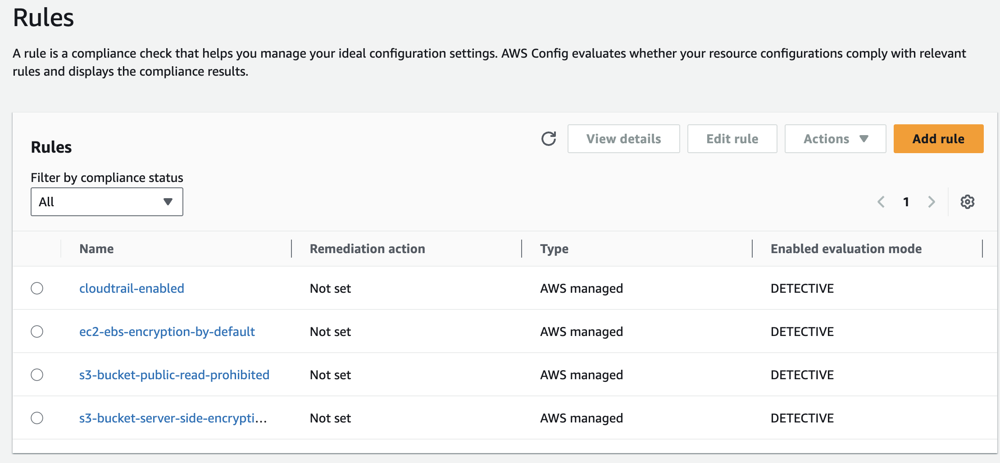 |
| ✅ Compliance Dashboard | 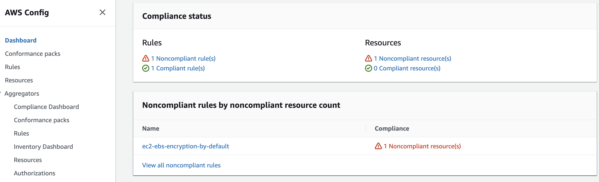 |
| ✅ Recording Active | 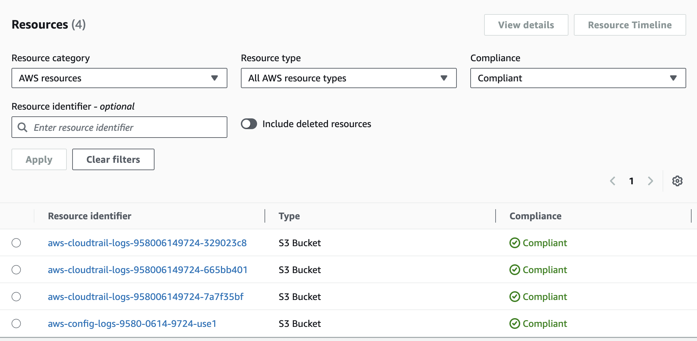 |
| ✅ Initial Setup – Recording Page | 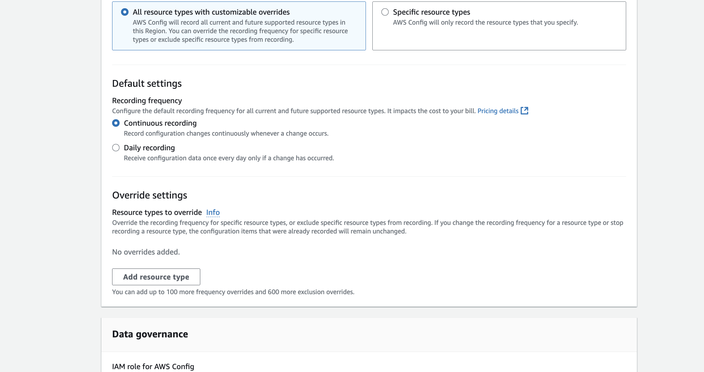 |

---

## Appendix – IAM Role (ISO 27001 Alignment)

**Role:** `AWSConfigRole` – Grants AWS Config permission to write encrypted logs to S3 and publish to SNS.

| ISO 27001 Control | Implementation |
|-------------------|----------------|
| A.8.16 Monitoring | Continuous recording via AWS Config |
| A.12.4.1 Event Logging | Config logs all resource changes |
| A.12.6.2 Restriction on Changes | Rule-based compliance checks |

**Trust Policy:** Allows `config.amazonaws.com` to assume the role.  
**Permissions:** Minimal S3 (PutObject), KMS (Encrypt/GenerateDataKey), SNS (Publish) for defined resources only.

---

##  Step 5A — AWS WAF + Firehose → S3 (Web Tier Protection & Logging)

In this step, I configured AWS WAF to protect the web tier (ALB) using AWS Managed Rules and enabled logging via Amazon Data Firehose to an S3 bucket.

**What I configured**
- Regional Web ACL in `us-east-1`, associated to the **Application Load Balancer** (ALB).
- AWS Managed Rule Groups (Action = Block):
  - `AWS-AWSManagedRulesCommonRuleSet`
  - `AWS-AWSManagedRulesKnownBadInputsRuleSet`
  - `AWS-AWSManagedRulesAmazonIpReputationList`
  - `AWS-AWSManagedRulesAnonymousIpList`
  - *(Optional)* `AWS-AWSManagedRulesSQLiRuleSet`
- WAF logging to Amazon Data Firehose delivery stream → S3 bucket for centralized log storage.
- IAM roles auto-created by the wizard for WAF and Firehose.

### ISO/IEC 27001 Mapping
- **A.8.20 Network controls** – WAF filters malicious traffic before it reaches the app.
- **A.8.21 Secure service configuration** – standardized managed rules for consistent protection.
- **A.12.4 Logging & monitoring** – immutable WAF logs stored securely in S3 for audit purposes.
- **A.8.16 Monitoring activities** – CloudWatch metrics per rule enabled.

### Screenshots

| Step | Screenshot |
|------|------------|
| ✅ Web ACL created & ALB associated | 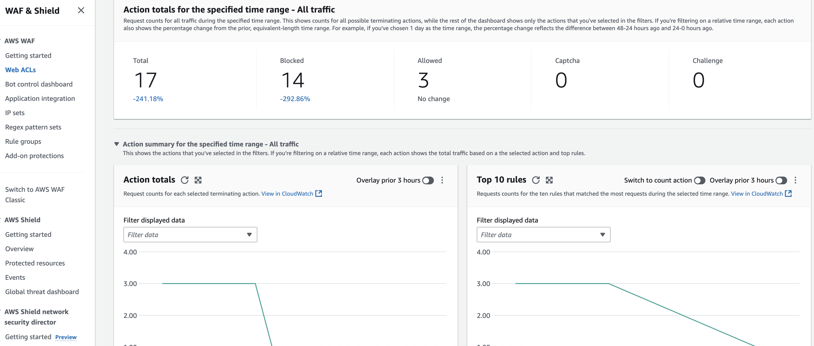 |
| ✅ Managed rules selected | 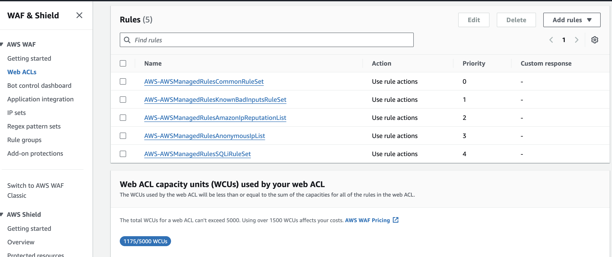 |
| ✅ Logging enabled to Firehose | 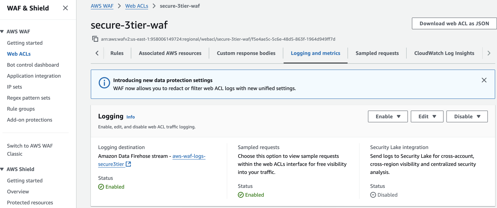 |
| ✅ WAF logs stored in S3 | 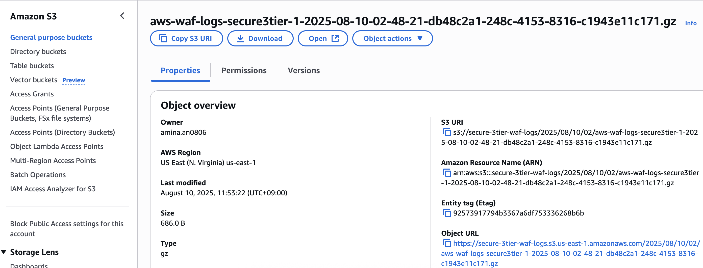 |

---

## Step 5B – Security Hub Configuration

### Goal
Enable and configure **AWS Security Hub** to continuously monitor the AWS environment against security best practices and compliance benchmarks.

### Steps Performed

1. **Enable AWS Security Hub**  
   - Navigated to **Security Hub → Settings → General**.  
   - Enabled AWS Security Hub for the current region.  
   - Cross-Region aggregation left unconfigured for this lab.

2. **Enable Security Standards**  
   - Opened **Security Hub CSPM → Security standards**.  
   - Enabled:
     - AWS Foundational Security Best Practices (FSBP) v1.0.0  
     - CIS AWS Foundations Benchmark v1.2.0  
   - Kept default control selections.

3. **Confirm AWS Service Integrations**  
   - Verified that **AWS Config** and **AWS CloudTrail** integrations show as **Connected**.  
   - (Optional) Checked **GuardDuty** connection if enabled.

4. **View Remediation Instructions**  
   - Opened a control from the enabled standards.  
   - Clicked **Remediation instructions** to view AWS documentation.

### Screenshots (Step-by-Step)

| Step | Screenshot |
|------|------------|
| ✅ Security Hub Enabled | 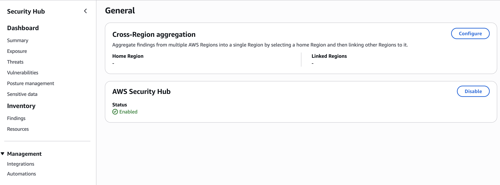 |
| ✅ Security Standards Enabled | 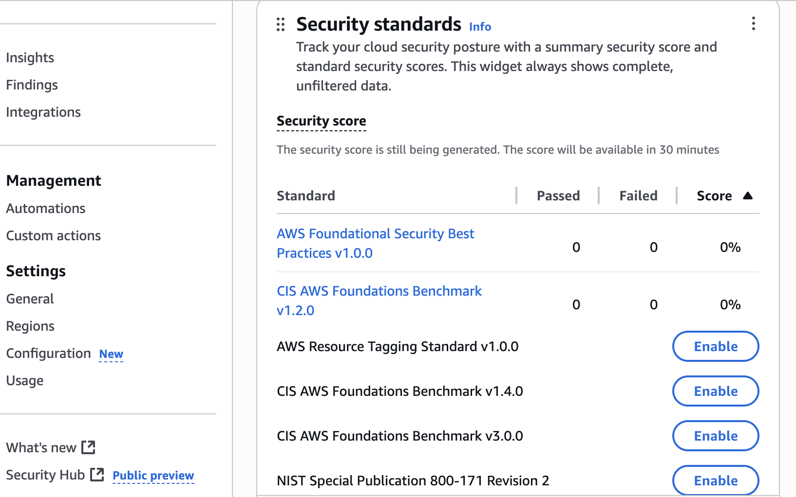 |
| ✅ Service Integrations Confirmed | 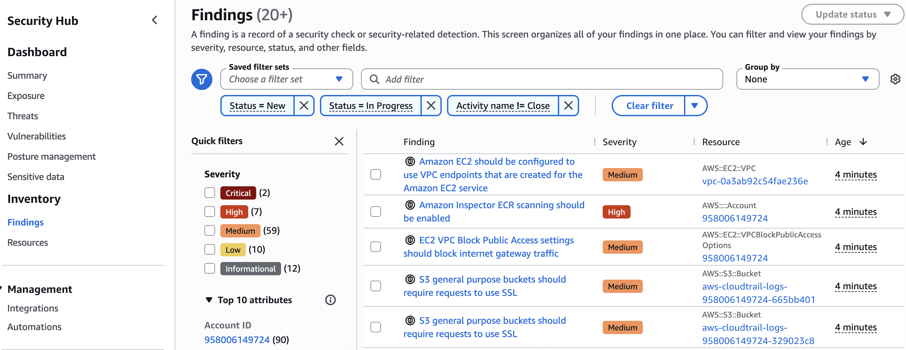 |
| ✅ Control Remediation Instructions | 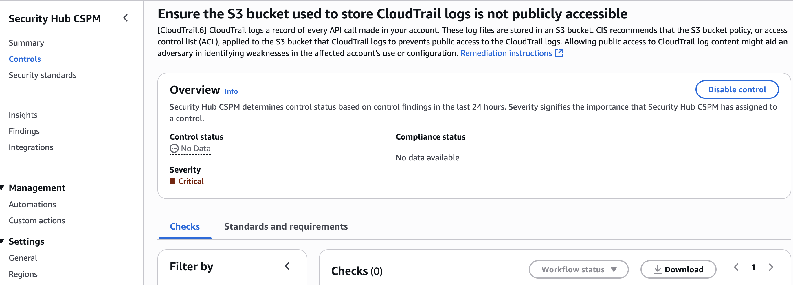 |

### ✅ Outcome
Security Hub is now active, integrated with core AWS security services, and continuously monitoring the account against industry standards.

---

## Compliance Mapping – ISO/IEC 27001:2022

The following table maps implemented AWS security controls in this project to the relevant ISO/IEC 27001:2022 Annex A control objectives.

Control mapping based on [AWS Compliance Documentation](https://aws.amazon.com/compliance/resources/) and ISO/IEC 27001:2022 Annex A controls.

| AWS Service / Security Control | Description of Implementation | ISO/IEC 27001:2022 Annex A Control(s) |
|--------------------------------|--------------------------------|----------------------------------------|
| [Amazon VPC](https://docs.aws.amazon.com/vpc/latest/userguide/what-is-amazon-vpc.html) with Public & Private Subnets | Segregates web, application, and database tiers; limits exposure of sensitive resources. | **A.8.20** – Network security; **A.8.22** – Segregation in networks |
| [Internet Gateway](https://docs.aws.amazon.com/vpc/latest/userguide/VPC_Internet_Gateway.html) + [NAT Gateway](https://docs.aws.amazon.com/vpc/latest/userguide/vpc-nat-gateway.html) | Secure internet access for public tier; controlled outbound-only access for private tier. | **A.8.20** – Network security |
| [Security Groups](https://docs.aws.amazon.com/vpc/latest/userguide/VPC_SecurityGroups.html) | Whitelist inbound/outbound traffic by port and protocol; principle of least privilege. | **A.8.20** – Network security; **A.8.21** – Network services security |
| [AWS IAM Roles](https://docs.aws.amazon.com/IAM/latest/UserGuide/id_roles.html) (Least Privilege) | EC2 and RDS use roles granting only required permissions; no hardcoded credentials. | **A.8.2** – Privileged access rights; **A.5.15** – Access control |
| [Amazon RDS Encryption with AWS KMS](https://docs.aws.amazon.com/AmazonRDS/latest/UserGuide/Overview.Encryption.html) | Encrypts database storage, automated backups, and snapshots. | **A.8.24** – Cryptographic controls; **A.8.28** – Secure disposal or re-use of equipment |
| [AWS CloudTrail](https://docs.aws.amazon.com/awscloudtrail/latest/userguide/cloudtrail-user-guide.html) (All Regions) | Records all API calls for auditing and investigations. | **A.8.15** – Logging; **A.5.23** – Information security monitoring |
| [AWS Config](https://docs.aws.amazon.com/config/latest/developerguide/WhatIsConfig.html) | Tracks configuration changes; checks compliance against policies. | **A.8.9** – Configuration management; **A.5.23** – Information security monitoring |
| [Amazon GuardDuty](https://docs.aws.amazon.com/guardduty/latest/ug/what-is-guardduty.html) | Detects anomalous or malicious activity (e.g., IAM credential abuse, reconnaissance). | **A.5.23** – Information security monitoring; **A.5.10** – Threat intelligence |
| [AWS WAF](https://docs.aws.amazon.com/waf/latest/developerguide/what-is-aws-waf.html) | Protects web tier against common attacks (SQLi, XSS, OWASP Top 10). | **A.8.25** – Secure development lifecycle; **A.5.14** – Protection against malware |
| [Amazon S3 SSE-KMS](https://docs.aws.amazon.com/AmazonS3/latest/userguide/UsingServerSideEncryption.html) | Encrypts static assets; enforces bucket policies and block public access. | **A.8.24** – Cryptographic controls; **A.5.14** – Protection against malware |
| Private Subnet for [Amazon RDS](https://docs.aws.amazon.com/AmazonRDS/latest/UserGuide/USER_VPC.html) | Removes direct internet exposure; access only from app tier. | **A.8.20** – Network security; **A.8.22** – Segregation in networks |

